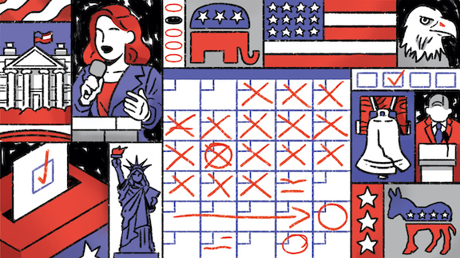

# Applied Data Science @ Columbia
## Fall 2020
## Project 1: A "data story" on how Americans vote



### [Project Description](doc/)
This is the first and only *individual* (as opposed to *team*) this semester. 

Term: Fall 2020

+ Projec title: A "data story" on how Americans vote
+ This project is conducted by Xujie Ma (xm2243)

+ Project summary: Throughout the EDA, I mainly found four points about how Americans vote.
1) More than half of voters decided to vote the way they did during or before conventions.
2) It seems that black people had a larger fraction who always voted for same party. The timing of white people to make voting decisions was relatively evenly distributed.
3) Generally, people with low level of education tended to vote for Democrat while people well educated tended to vote for Republican.
4) People with high income were more likely to vote for Republican while people with low income were more likely to vote for Democrat.

Following [suggestions](http://nicercode.github.io/blog/2013-04-05-projects/) by [RICH FITZJOHN](http://nicercode.github.io/about/#Team) (@richfitz). This folder is orgarnized as follows.

```
proj/
├── dev/
├── data/
├── doc/
├── figs/
└── output/
```

Please see each subfolder for a README file.
