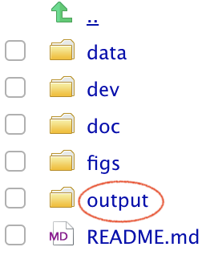
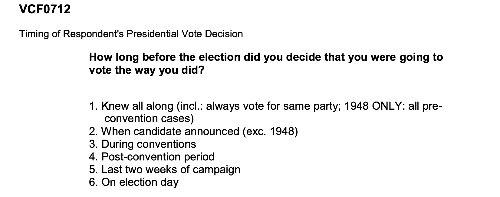
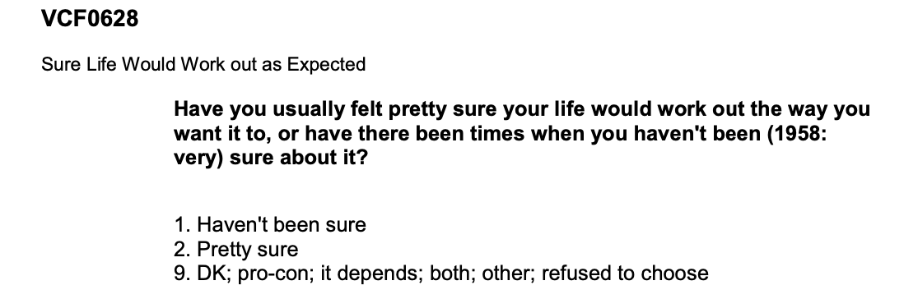

This is an [R Markdown](http://rmarkdown.rstudio.com) Notebook. 

# 1. Introduction
The *American National Election Studies* (ANES) are surveys of voters in the U.S. on the national scale. For each predidential election since 1948, ANES collects responses from respondents both before and after the election. The goal of ANES is to understand political behaviors using systematic surveys. ANES's data and results have been routinely used by news outlets, election campaigns and political researchers.

The *Time Series Cumulative Data* of ANES include answers, from respondents from different years, on selected questions that have been asked in three or more ANES' *Time Series* studies. Tremendous amount of efforts have been put into data consolidation as variables are often named differently in different years. 

A rule of thumb for analyzing any data set is to understand its study design and data collection process first. You are strongly encouraged to read the *codebooks*. 

# 2. Access to ANES Data
## Step 2.1: Register to access ANES dataset. 
To access the data, you should register at ANES's [website](https://electionstudies.org/) and accept its terms of use, especially committing to "use these datasets solely for research or statistical purposes and not for investigation of specific survey respondents."

## Step 2.2: Download the ANES Time Series Cumulative Data
Once you are logged into ANES's website, you should be able to download the data file. You can use ASCII, DTA or SAV. In this notebook, we use the *SAV* format. The downloaded file is a zip file, you should move all unzipped files into the `data` folder of your project 1's local folder. 


# 3. Data processing for this R Notebook.

The following code blocks prepare a processed data set and save it in the `output` folder. The data folder should be only used for storing raw `data`. All processed data should be saved in the `output` folder. The notion here is that one can delete files from the output folder and reproduce them by re-running the codes. 



### Step 3.1 Checking `R` packages for data processing

From the packages' descriptions:

+ `tidyverse` is an opinionated collection of R packages designed for data science. All packages share an underlying design philosophy, grammar, and data structures;
+ `haven` enables `R` to read and write various data formats used by other statistical packages. `haven` is part of the `tidyverse`.
+ `devtools` provides a collection of package development tools.
+ `RColorBrewer` provides ready-to-use color palettes.
+ `DT` provides an R interface to the JavaScript library DataTables;
+ `ggplot2` a collection of functions for creating graphics, based on The Grammar of Graphics.

```{r load libraries, warning=FALSE, message=FALSE, include=FALSE}
packages.used=as.list(
  c(
  "tidyverse",
  "haven",
  "devtools",
  "RColorBrewer",
  "data.table",
  "ggplot2")
)

check.pkg = function(x){
  if(!require(x, character.only=T)) install.packages(x, 
                                                     character.only=T,
                                                     dependence=T)
}

lapply(packages.used, check.pkg)
```


### Step 3.2 Import raw ANES data

We will be working with the SAV format of the raw ANES data, downloaded from [this page](https://electionstudies.org/data-center/anes-time-series-cumulative-data-file/), once you are registered *and* logged in. This is a saved data file from SPSS. We will use the `read_sav` function from the `haven` package. 

Read more about [importing SPSS data into R](https://www.marsja.se/how-to-read-write-spss-files-in-the-r-statistical-environment/).

```{r read in data, message = F}
library(haven)
anes_dat <-
    read_sav("../data/anes_timeseries_cdf.sav")
```

Some basic data summaries: there are `r nrow(anes_dat)` respondents and `r ncol(anes_dat)` variables.

```{r year barplot}
barplot(table(anes_dat$VCF0004),
        las=2,
        main="number of respondents over the years")
```

Some variables are asked nearly all the years and some are asked only a few years. 

```{r NAs}
anes_NAs=anes_dat%>%
  summarise_all(list(na.mean=function(x){
                              mean(is.na(x))}))
anes_NAs=data.frame(nas=unlist(t(anes_NAs)))

ggplot(anes_NAs, aes(x=nas)) + 
  geom_histogram(color="black", 
                 fill="white",
                 binwidth=0.05)+
  labs(title="Fractions of missing values")
```

### Step 3.3 Process variables for analysis
In the following, I will create a few variables for this analysis. These variables were selected based on their description in the ANES codebook.

First let's look at our data. One advantage of using the SPSS SAV data is that the values are *labelled*. By converting labelled data to factor, you can easily reveal the responses encoded by numbers. I selected four variables for subsequent analysis and save the filtered data sets to the `output` folder. 

```{r labelled variables subset}
Election_years=as.character(seq(1952, 2016, 4))

anes_use=anes_dat%>%
  mutate(
    year=as_factor(VCF0004),
    race=as_factor(VCF0105a),
    decisiontime=as_factor(VCF0712),
    vote=as_factor(VCF0706),
    education=as_factor(VCF0110),
    income=as_factor(VCF0114),
    sureaboutlife=as_factor(VCF0628)
  )%>%
  filter(year %in% Election_years)

library(data.table)

data.table(anes_use%>%
             select(year, race, decisiontime, vote, education, income, sureaboutlife)%>%
             filter(!is.na(decisiontime))%>%
             sample_n(30))


anes_use = anes_use%>%select(year, race, decisiontime, vote, education, income, sureaboutlife)

save(anes_use, file="../output/data_use.RData")
```

# 4. The analysis

## 4.1 When did voters decide that they were going to vote the way they did?

First, we would like to see when people decided they were going to vote the way they did.



```{r timing of decision analysis}
load(file="../output/data_use.RData")
anes_to_decisiontime_year = anes_use %>%
  filter(!is.na(decisiontime))%>%
  group_by(year)%>%
  count(decisiontime)%>%
  mutate(prop=n/sum(n))

ggplot(anes_to_decisiontime_year, 
       aes(x=year, y=prop, fill=decisiontime)) +
  geom_bar(stat="identity", colour="black") + facet_wrap(~1, ncol=1) + theme_bw()+
  theme(axis.text.x = element_text(angle = 90))+
  scale_fill_brewer(palette="Blues")+
  labs(title="When did people make voting decisions?")
```

Looks like more than half of voters decided to vote the way they did during or before conventions. And I think political parties should seize this time to get votes.

## 4.2 When did different racial groups decide that they were going to vote the way they did?

```{r timing of decision across races analysis, fig.height=14, fig.width=8}
anes_to_decisiontime_year = anes_use %>%
  filter(!is.na(race) & !is.na(decisiontime))%>%
  group_by(year, race)%>%
  count(decisiontime)%>%
  group_by(year, race)%>%
  mutate(
    prop=n/sum(n)
  )

ggplot(anes_to_decisiontime_year, 
       aes(x=year, y=prop, fill=decisiontime)) +
  geom_bar(stat="identity", colour="black") + facet_wrap(~race, ncol=1) + theme_bw()+
  theme(axis.text.x = element_text(angle = 90))+
  scale_fill_brewer(palette="Blues")+
  labs(title="When did different racial groups that they were going to vote the way they did?")
```

It seems that a large fraction of black people had knew all along whom to vote relative to other races. The timing of making voting decisions of white people was relatively evenly distributed. The sample size of Asian and Indian respondents was small.

## 4.3 Who did they vote for in the election?
### Step 4.3.1 Who did different education groups vote for in the election over the years?

```{r vote analysis across education, fig.height=14, fig.width=8}
anes_vote_education_year = anes_use %>%
  filter(!is.na(education) & !is.na(vote))%>%
  filter(vote!="7. Did not vote or voted but not for president (exc.1972)")%>%
  group_by(year, education)%>%
  count(vote)%>%
  group_by(year, education)%>%
  mutate(
    prop=n/sum(n)
  )
#%>%
#  filter(vote == "1. Democrat" | vote == "2. Republican")

ggplot(anes_vote_education_year, 
       aes(x=year, y=prop, fill=vote)) +
  geom_bar(stat="identity", colour="black")+ 
  scale_fill_manual(values=c("dodgerblue3", "firebrick2", "gold1", "lightgoldenrod1"))+
  facet_wrap(~education, ncol=1) + 
  theme(axis.text.x = element_text(angle = 90))+
  labs(title="Who did different education groups vote for in the election over the years?")
```

Generally, people with low level of education tended to vote for Democrat while people well educated tended to vote for Republican.

### Step 4.3.2 Who did different income groups vote for in the election over the years?


```{r voting analysis across income, fig.height=14, fig.width=8}
anes_vote_income_year = anes_use %>%
  filter(!is.na(income) & !is.na(vote))%>%
  filter(vote!="7. Did not vote or voted but not for president (exc.1972)")%>%
  group_by(year, income)%>%
  count(vote)%>%
  group_by(year, income)%>%
  mutate(
    prop=n/sum(n)
  )
#%>%
#  filter(vote == "1. Democrat" | vote == "2. Republican")

ggplot(anes_vote_income_year, 
       aes(x=year, y=prop, fill=vote)) +
  geom_bar(stat="identity", colour="black")+ 
  scale_fill_manual(values=c("dodgerblue3", "firebrick2", "gold1", "lightgoldenrod1"))+
  facet_wrap(~income, ncol=1) + 
  theme(axis.text.x = element_text(angle = 90))+
  labs(title="Who did different income groups vote for in the election over the years?")
```

To sum up, people with high income were more likely to vote for Republican while people with low income were more likely to vote for Democrat.

## 4.4 Who felt more sure about life?

When looking through the codebook, I found an interesting indicator that measured how sure people felt life would work out as expected. And I wanted to research the relationship between this feeling and education level.



```{r feeling sure about life analysis, fig.height=14, fig.width=8}
anes_vote_sureaboutlife_year = anes_use %>%
  filter(!is.na(education) & !is.na(sureaboutlife))%>%
  filter(vote!="9. DK; pro-con; it depends; both; other; refused to ")%>%
  group_by(year, education)%>%
  count(sureaboutlife)%>%
  group_by(year, education)%>%
  mutate(
    prop=n/sum(n)
  )
#%>%
#  filter(vote == "1. Democrat" | vote == "2. Republican")

ggplot(anes_vote_sureaboutlife_year, 
       aes(x=year, y=prop, fill=sureaboutlife)) +
  geom_bar(stat="identity", colour="black")+ 
  scale_fill_manual(values=c("dodgerblue3", "firebrick2", "gold1", "lightgoldenrod1"))+
  facet_wrap(~education, ncol=1) + 
  theme(axis.text.x = element_text(angle = 90))+
  labs(title="Who felt more sure about life?")
```

We could see that with higher education level, people felt more sure life would work out as expected. Probably because well-educated people could get a better and more stable job which could give them sense of security.
